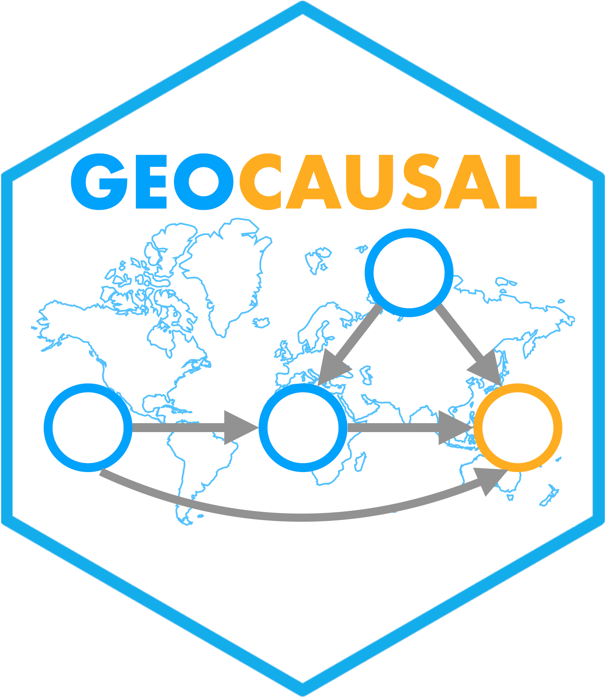

<!-- README.md is generated from README.Rmd. Please edit that file -->

# geocausal <a href="https://github.com/mmukaigawara/geocausal"></a>

<!-- badges: start -->

[](https://cran.r-project.org/package=geocausal)
[](https://cran.r-project.org/package=geocausal)
[](https://cran.r-project.org/package=geocausal)
<!-- badges: end -->

The goal of the package
[geocausal](https://github.com/mmukaigawara/geocausal) is to implement
causal inference analytic methods based on spatio-temporal data. Users
provide the raw data of locations and timings of treatment and outcome
events, specify counterfactual scenarios, and the package estimates
causal effects over specified spatial and temporal windows.

Please refer to the following preprint for the user guide.

> Mukaigawara M, Zhou L, Papadogeorgou G, Lyall J, and Imai K (2024).
> Geocausal: An R Package for Spatio-temporal Causal Inference. OSF
> Preprints. August 27. <https://doi.org/10.31219/osf.io/5kc6f>.

For methodological details, please refer to the following article.

> Papadogeorgou G, Imai K, Lyall J, and Li F (2022). Causal inference
> with spatio-temporal data: Estimating the effects of airstrikes on
> insurgent violence in Iraq. *J R Stat Soc Series B.*
> <https://doi.org/10.1111/rssb.12548>.

## Citation

Please cite this package as follows:

> Mukaigawara M, Zhou L, Papadogeorgou G, Lyall J, and Imai K (2024).
> Geocausal: An R Package for Spatio-temporal Causal Inference. OSF
> Preprints. August 27. <https://doi.org/10.31219/osf.io/5kc6f>.

## Installation

You can install the package
[geocausal](https://github.com/mmukaigawara/geocausal) from
[GitHub](https://github.com/mmukaigawara/geocausal) with:

``` r
# install.packages("devtools")
devtools::install_github("mmukaigawara/geocausal")
```

and [CRAN](https://cran.r-project.org/package=geocausal) with:

``` r
install.packages("geocausal")
```
